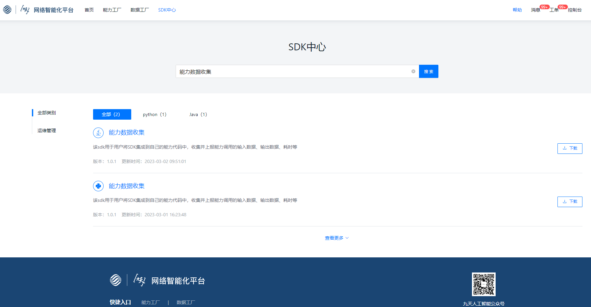

# 功能说明
该sdk提供能力推理数据采集的功能，用户可在能力服务端代码中引入此sdk，进行服务调用信息的远程上报。具体上报内容包括：
+ 接口url 
+ 服务类型（同步/异步） 
+ 响应状态码（200/500）
+ 请求参数
+ 返回结果
+ 返回结果是否正确  

# 接入步骤
#### 第1步：请先联系平台管理员（wangyanjiao@chinamobile.com/kangkailun@chinamobile.com）申请接入

#### 第2步：进入网络智能化平台【SDK中心】页面，找到【推理数据采集】sdk，目前提供了Python和Java
两个版本，此处选择Python版本进行下载

#### 第3步：将下载的zip压缩包进行解压， 将解压后的report文件夹放到能力代码根目录下

#### 第4步：在能力代码中引入sdk模块，代码如下（请确保Python版本在3.6以上）
```python
from report.collector import ReportCollector
from report import report_service
```
#### 第5步：传入能力调用的具体参数
```python
collector = ReportCollector.url('/your/path') #对象初始化
#接口入参和出参
collector.single_param('name', 'value').single_param('name2', 'value2')\ 
.multi_param({'name3': 'value3'})\ 
.file_param('file1', file_obj)\
.output_data({'resp':'success'})
#透传请求头中的能力信息
collector.header_param('从http请求头里取出')
#传入接口调用状态和结果
collector.response_code(200).is_success(True)
```

#### 第6步：调用上报接口进行服务信息上报
```python
report_service.report(collector)
```

# 参数说明

|<div style="width:100px">参数</div>| <div style="width:100px">类型</div> |<div style="width:400px">参数说明</div>|
|:---:|:---:|:---:|
|url|str|接口请求路径|
|header_param|str|从Http请求头取出'ability_invoking_param'对应的值|
|is_async|bool|是否是异步接口，默认是False|
|single_param|str|添加参数名称和参数值，多个参数需要多次调用此方法|
|multi_param|dict|将所有参数构造成字典类型传入|
|file_param|file|添加参数名称和文件对象，多个文件需要多次调用此方法|
|output_data|dict|接口返回结果|
|response_code|int|接口响应状态码，成功:200 出现异常:500|
|is_success|bool|返回结果是否正确，默认为None|


# 示例代码
```python
import json

from flask import Flask, request
from report.collector import ReportCollector
from report import report_service
import random

app = Flask(__name__)
app.config["MAX_CONTENT_LENGTH"] = 32 * 1024 * 1024


@app.route('/', methods=['GET'])
def index():
    return 'hello my flask'


# Get 请求获取 Parameter 示例请求
@app.route('/getArg', methods=['GET'])
def test_get():
    name = request.args.get('name', '')
    score = request.args.get('score', '50')
    param = ReportCollector.url('/getArg', True) \
        .header_param(request.headers.get('ability_invoking_param')) \
        .single_param('name', name).single_param('score', score)
    try:
        seed = random.random()
        print('seed: ' + str(seed))
        param.is_success(True).response_code(200)
    except Exception as ex:
        param.is_success(False).response_code(500)
        print("ex= ", ex)
    finally:
        param.output_data({"name": name})
        report_service.report(param)
    print(param.__dict__)
    return {"msg": name}, 200, {"Content-Type": "application/json"}


# Post 请求获取 data-form 及 x-www-form-urlencoded 示例请求
@app.route('/postForm', methods=['POST'])
def test_form():
    param = ReportCollector.url('/postForm', True).header_param(request.headers.get('ability_invoking_param'))
    try:
        # biz start
        print(request.form)
        seed = random.random()
        print('seed: ' + str(seed))

        for key in request.form:
            param.single_param(key, request.form[key])
        # biz end
        param.is_success(True).response_code(200)
        param.output_data('{"msg": "suc"}')
    except Exception as ex:
        print(ex)
        param.is_success(False).response_code(500)
    finally:
        report_service.report(param)
        print(param.__dict__)
    file_name = ''
    return json.dumps({
        "form": request.form,
    }), 200, {"Content-Type": "application/json"}


# Post 请求上传文件示例请求
@app.route('/uploadFile', methods=['POST'])
def upload_file():
    param = ReportCollector.url('/postForm', True).header_param(request.headers.get('ability_invoking_param'))
    if len(request.files) > 0:
        file_ = request.files['file']
        try:
            # biz start
            seed = random.random()
            print('seed: ' + str(seed))
            # 由于 request 中文件流无法重复读取，为了不影响业务，建议先将文件保存在本地，再传入 collector
            file_.save('tmp/' + file_.filename)
            param.file_param('file', open('tmp/' + file_.filename, mode='rb'))
            # biz end
            param.is_success(True).response_code(200)
            param.output_data('{"msg": "suc"}')
        except Exception as ex:
            print(ex)
            param.is_success(False).response_code(500)
        finally:
            report_service.report(param)
            print(param.__dict__)
        file_name = ''
        if len(request.files) > 0:
            file_name = file_.filename
        return json.dumps({
            "file": file_name
        }), 200, {"Content-Type": "application/json"}
    else:
        return "file not found", 500


# Post 请求获取 data-raw 示例请求
@app.route('/postRequestBody', methods=['GET', 'POST'])
def test_request_body():
    param = ReportCollector.url('/postRequestBody', True).header_param(
        request.headers.get('ability_invoking_param')).multi_param(request.get_json())
    try:
        # biz start
        print(request.get_json())
        seed = random.random()
        print('seed: ' + str(seed))
        param.is_success(True).response_code(200).output_data(request.get_json())
    except Exception:
        param.is_success(False).response_code(500)
    finally:
        report_service.report(param)
    print(param.__dict__)
    # biz end
    return request.get_json(), 200, {"Content-Type": "application/json"}


if __name__ == '__main__':
    app.run(port=8080)
```

# 注意事项
1. 一次请求仅需调用一次report方法上报信息，请勿重复调用
2. 新镜像上线部署后请联系管理员进行功能验证